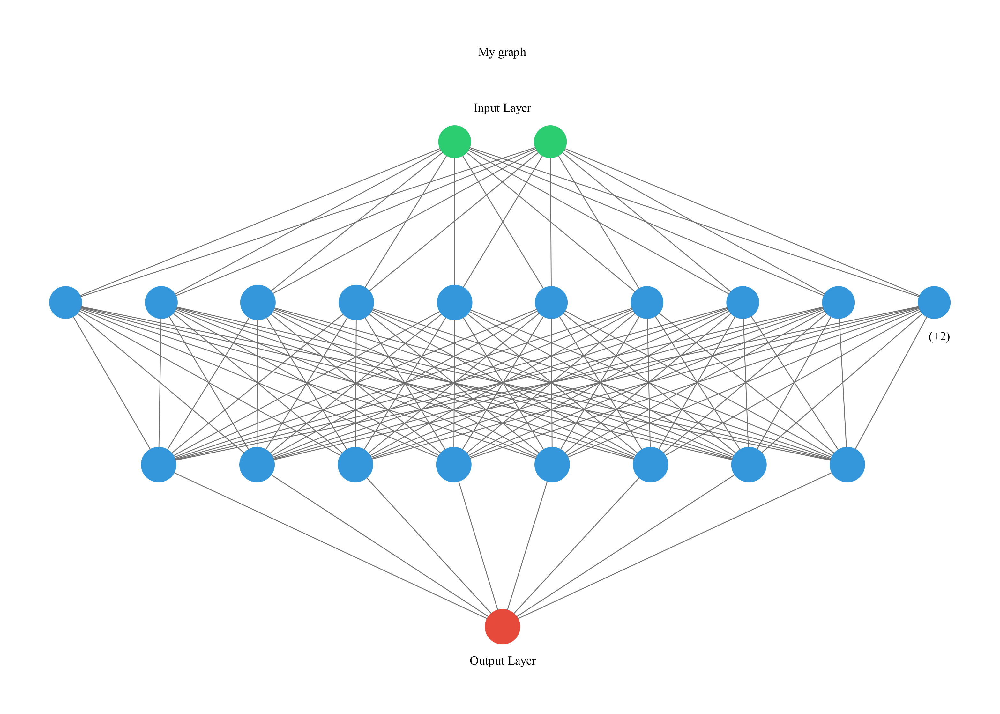

# Interactive-Graphs-and-Widgets
## Collection of interactive Jupiter Notebook graphs and widgets  

This collection has been made possible thanks to:  

[SamLau95](https://github.com/SamLau95/nbinteract/tree/master/notebooks)  
[nbinteract](https://www.nbinteract.com/tutorial/tutorial_publishing.html)  
[Piotr Skalski](https://towardsdatascience.com/lets-code-a-neural-network-in-plain-numpy-ae7e74410795)  
[StackOverFlow](https://stackoverflow.com/questions/29888233/how-to-visualize-a-neural-network)  

Artificial Neural Network decision boundary during model training:

Logistic Regression decision boundary during model Model Training:

Artificial Neural Network Diagram Structure Genereator  

