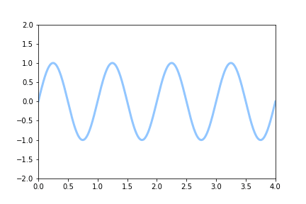
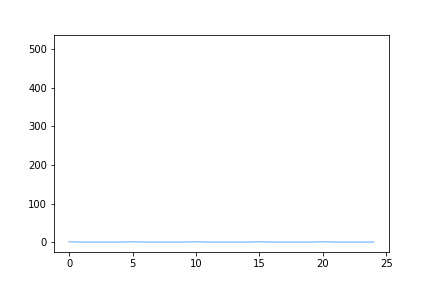

  
[![Forks][forks-shield]][forks-url]
[![Stargazers][stars-shield]][stars-url]
[![Issues][issues-shield]][issues-url]
[![LinkedIn][linkedin-shield]][linkedin-url]

# Data-Visualization
## Collection of interactive Jupiter Notebook graphs and widgets  

This collection has been made possible thanks to:  

[SamLau95](https://github.com/SamLau95/nbinteract/tree/master/notebooks)  
[nbinteract](https://www.nbinteract.com/tutorial/tutorial_publishing.html)  
[Piotr Skalski](https://towardsdatascience.com/lets-code-a-neural-network-in-plain-numpy-ae7e74410795)  
[StackOverFlow](https://stackoverflow.com/questions/29888233/how-to-visualize-a-neural-network)  

Some examples of animations created in this repository are available online on my personal WebSite at [this link.](https://pierpaolo28.github.io/Projects/project9.html)   

Artificial Neural Network decision boundary during model training:

Logistic Regression decision boundary during model Model Training:

Artificial Neural Network Diagram Structure Generator:

Matplotlib Animation API:

Celluloid:

[contributors-shield]: https://img.shields.io/github/contributors/pierpaolo28/Data-Visualization.svg?style=flat-square
[contributors-url]: https://github.com/pierpaolo28/Data-Visualization/graphs/contributors
[forks-shield]: https://img.shields.io/github/forks/pierpaolo28/Data-Visualization.svg?style=flat-square
[forks-url]: https://github.com/pierpaolo28/Data-Visualization/network/members
[stars-shield]: https://img.shields.io/github/stars/pierpaolo28/Data-Visualization.svg?style=flat-square
[stars-url]: https://github.com/pierpaolo28/Data-Visualization/stargazers
[issues-shield]: https://img.shields.io/github/issues/pierpaolo28/Data-Visualization.svg?style=flat-square
[issues-url]: https://github.com/pierpaolo28/Data-Visualization/issues
[license-shield]: https://img.shields.io/github/license/pierpaolo28/Data-Visualization.svg?style=flat-square
[linkedin-shield]: https://img.shields.io/badge/-LinkedIn-black.svg?style=flat-square&logo=linkedin&colorB=555
[linkedin-url]: https://www.linkedin.com/in/pierpaolo28/
[product-screenshot]: images/screenshot.png
