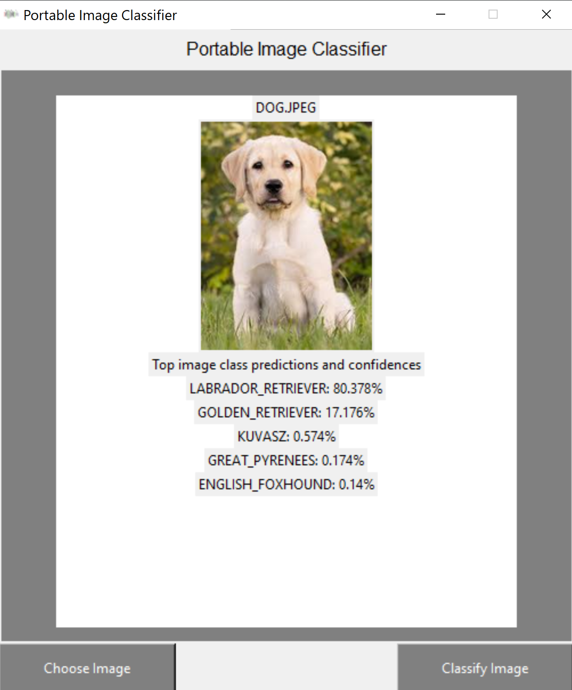

# Tkinter Machine Learning Image Classifier

GUI based machine learning classifier created using Tkinter and Tensorflow VGG16 pre-trained classifier. This Python program, has then been converted into an executable using Pyinstaller and NSIS (in order to download just the needed dependencies to create the EXE file, a virtual environment has been used). 

```python
pyinstaller main.spec
```



In case you can be interested in contributing to this project, a requirements.txt is available in order to install the required dependencies.

Additionally, an alternative version of the image classifier using Pytorch Alexnet pretrained model is available in the PyTorch folder.

If you are interested in trying yourself this application, please fell free to download and install the Image Classifier.exe executable on your Windows machine.
